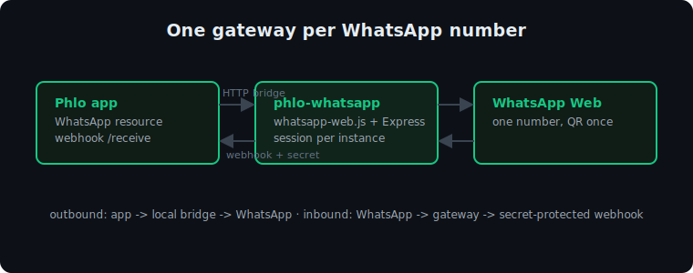

# Phlo WhatsApp

WhatsApp Web gateway (whatsapp-web.js + Express) for the [Phlo](https://phlo.tech) framework. One process per WhatsApp number; inbound messages reach the app through a secret-protected webhook, outbound messages are sent through a local HTTP bridge.

Phlo WhatsApp is the messaging half of the Phlo server layer, next to Phlo Realtime (the WebSocket layer built into the [Phlo Daemon](https://github.com/q-ainl/phlo-daemon)) for realtime. The engine's `WhatsApp` resource handles the webhook on the app side; the [Phlo Dashboard](https://github.com/q-ainl/phlo-dashboard) shows the status of every instance across the fleet. Try it end to end with the [Phlo WhatsApp demo](https://github.com/q-ainl/phlo-demo-whatsapp), a standalone app that sends text, images, polls and locations.



## Usage
```js
require('./phlo-whatsapp.js')('wa1', 8081, '<secret>', 'https://app.example.com/receive/whatsapp/web/wa1')
```
Arguments: `(instanceId, port, secret, webhookUrl)`.

On first start the instance prints a QR code in the terminal; scan it with the WhatsApp account that this instance should send and receive as. The session is persisted, so this is a one-time step per instance.

## Install
```sh
npm install   # deps: whatsapp-web.js, express, axios, qrcode-terminal
```

## Production

Keep one small config file per instance so the gateway and its webhook are managed in one place:

```js
// config/wa1.js  (node-local, keep out of version control)
require('../whatsapp/phlo-whatsapp.js')('wa1', 8081, 'a-long-random-secret', 'https://app.example.com/receive/whatsapp/web/wa1')
```

The secret is an inline literal on purpose: the Phlo Dashboard discovers each
instance and proxies to it by reading `config/wa*.js`, so it must be a plain
string here, not pulled from an env var the dashboard cannot see. Keep this
file node-local and out of version control.

Run each instance under a process manager, for example pm2:

```sh
pm2 start config/wa1.js --name wa1
pm2 save
```

## Environment

| Variable | Default | Effect |
| --- | --- | --- |
| `WA_HOST` | `127.0.0.1` | Listen address. The Docker image sets `0.0.0.0` so a sibling container can reach it. |
| `WA_WEBHOOK_TIMEOUT` | `10000` | Per-attempt webhook request timeout (ms). |
| `WA_WEBHOOK_RETRIES` | `3` | Attempts before an inbound delivery is dropped (bounded exponential backoff on network/timeout/5xx/429). |

The Docker entrypoint (`docker/boot.js`) also reads `WA_PORT`, `WA_WEBHOOK` and `WA_SECRET`, and refuses to start without a `WA_SECRET`.

## License

MIT. See [LICENSE](LICENSE).
